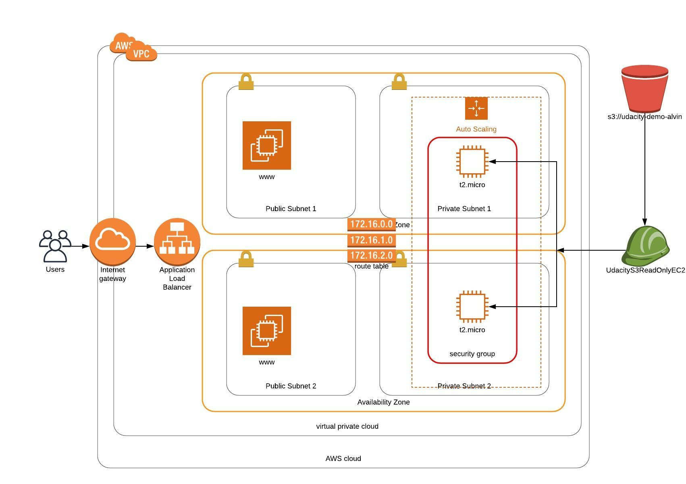

### Project Title - Deploy a high-availability web app using CloudFormation

In this project (Udagram App), I deployed web servers for a highly available web app using CloudFormation. I wrote the script that creates and deploys the infrastructure and application for an Udagram app from the ground up. The script begin deploying the networking components followed by servers, security roles and software.

#### Instruction of deploy:
./create.sh infra infra.yml  infra-parameters.json
./create.sh UdagramApp server.yml  server-parameters.json

#### Note:
before deploy:
1. need to create s3 bucket and upload the files in s3
2. create a role to access EC2